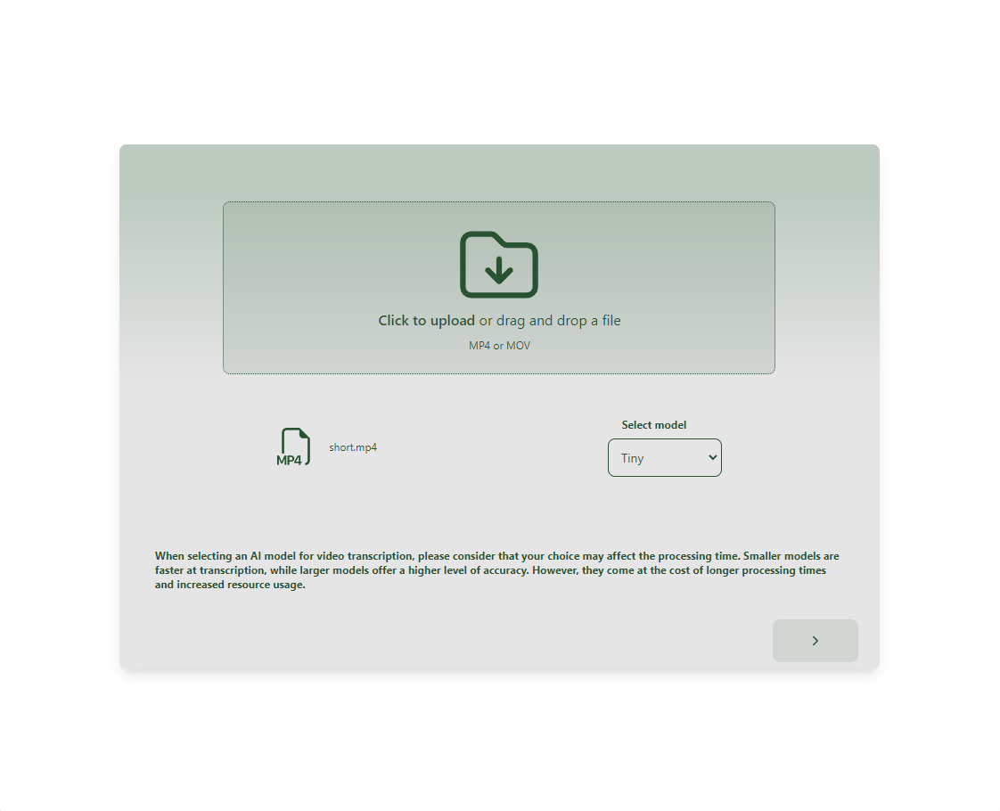
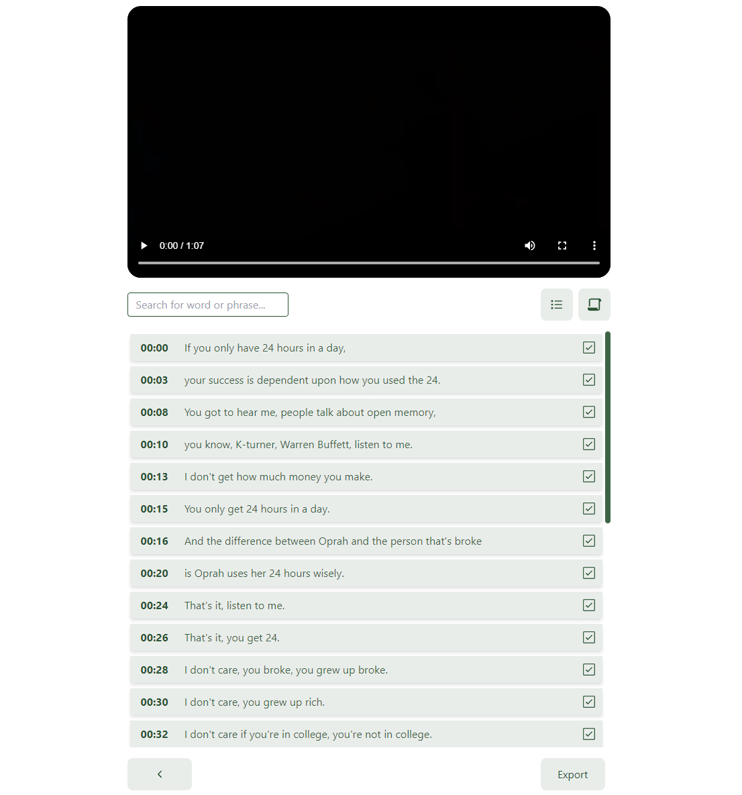
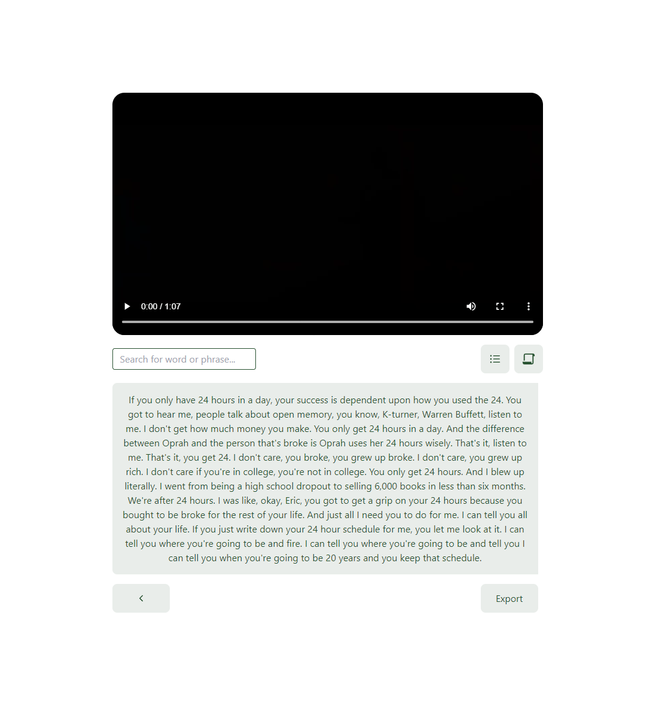

# Video Whisper

An electron application that bundles whisper-ai in order to transcribe video files and allow users to generate videos
using timestamps from transcribed video.

The project is not finished , i didn't have time to properly build the distribution flow.
I use Linux as my daily driver but i decided to build this targeting Windows machines.
The application works but there are lots of things to polish to make an nice MVP.

# TODO

1. Router , currently there is no routing system - hash router should be implemented.
2. Code architecture , the project could have better folder structure.
3. CUDA capabilities , i didn't have time to test it properly so the default transcription device is CPU instead of CUDA.
4. No control over output file , currently the exported MP4 file is given random name and its stored on users PC.
5. Text view has no real usage.
